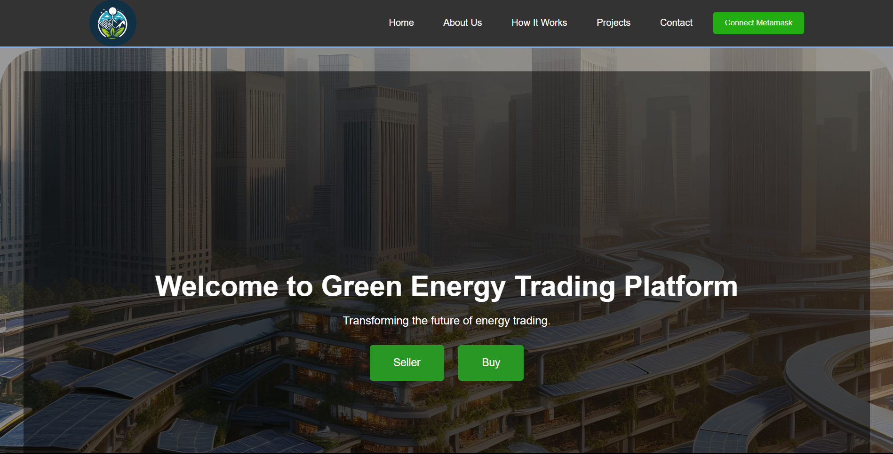

# MINIWATTS  

Hello everyone!! we are team Notsubzero, this is our project based on Renewable energy trading for Hack The league 3.

## Overview

Our idea is about establishing an energy trading platform leveraging blockchain technology. The goal is to facilitate the exchange of surplus energy produced by solar rooftops within a specific area, such as the Pratapnagar sector XYZ, where there are societies, builder blocks, landowners, complexes, and local residents with varying energy needs.
    
  One key insight is the temporal misalignment of energy supply and demand. For instance, while there might be excess energy generated during daylight hours, the peak demand typically occurs in the evening when households require more electricity for cooling and other purposes.
 
  To address this, we propose the creation of a tokenized system that enables the trading of electricity. Participants in the platform, including both energy producers and consumers, can engage in bidding for electricity based on their requirements. We envision a system where producers are incentivized to maximize efficiency and minimize waste, while consumers are encouraged to prioritize green energy consumption.
 
  Overall, the vision is to create a sustainable and efficient energy ecosystem that benefits both producers and consumers while promoting environmental stewardship within the community.

### Requirements 

 1.<b>Decentralized Trading:</b>  Trade energy directly with other users without intermediaries. 
 2.<b>Secure Transactions:</b> Utilize blockchain technology to ensure transaction security and transparency. 
3.<b>MetaMask Integration:</b> Easy access to the platform using the MetaMask wallet  
  4.<b>Token-Based System:</b> Use blockchain tokens for buying, selling, and trading energy. 
  5. <b>Real-Time Data:</b> Monitor energy prices and transaction history in real-time.

## Technology Stack

- **Blockchain**: polygon network for decentralized transactions.
- **Smart Contracts**: Solidity for writing and deploying smart contracts.
- **MetaMask**: Browser extension for managing Ethereum wallets and transactions.
- **Frontend**: for building the user interface.

## snapshots

 
